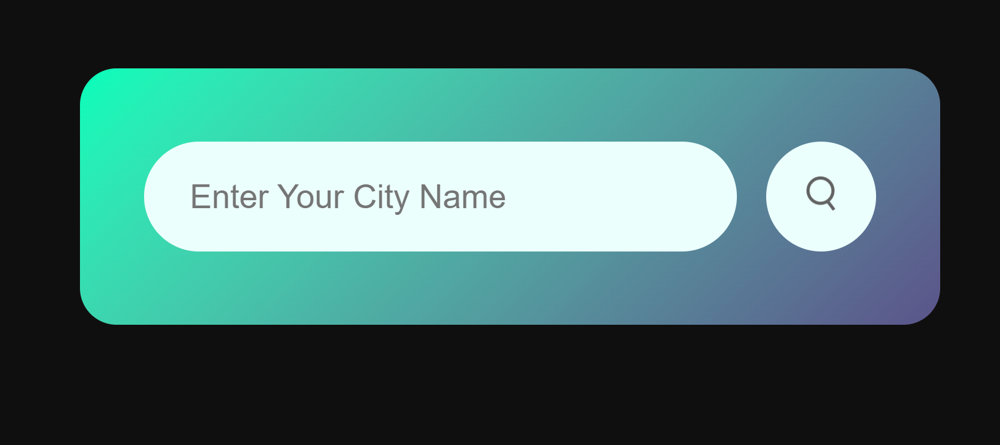
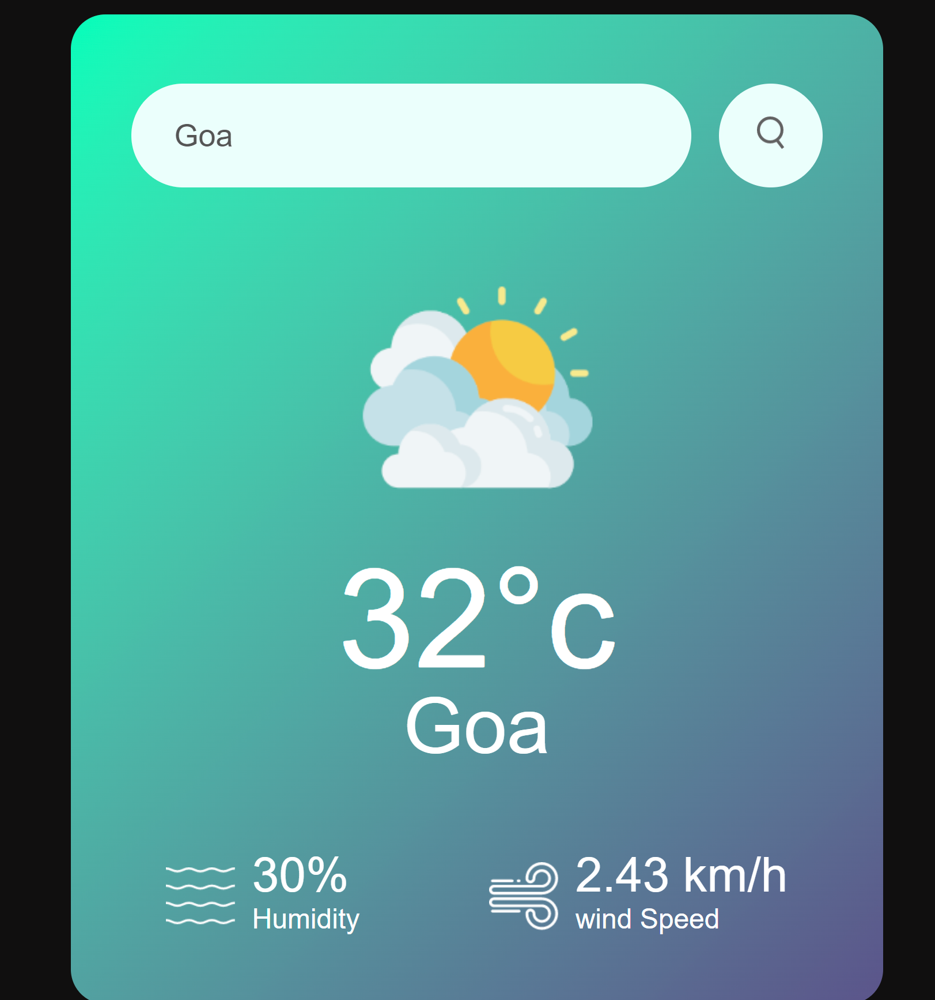

# SkyCast

SkyCast is an app to determine the weather of the particular city which is entered by the user.

## Technologies:
1. JavaScript
2. HTML
3. CSS

## API Used
**OpenWeatherAPI**: `https://api.openweathermap.org/data/2.5/weather?&units=metric&q=` This is the api used in the project. You need to sign up to openweather and create your own API Key to use this. 

### Structure of the `env.js` file
You have to create the `env.js` file and put the following content in the project directory
```Javascript
const API_KEY = "<Your API Key here>";
```

## How to run ?
As this is web front project only build with the help of HTML and Javascript, you can directly open the index.html file which has all the reference of the javascript files and the css files.

## Screenshots
#### Startup

#### Output
